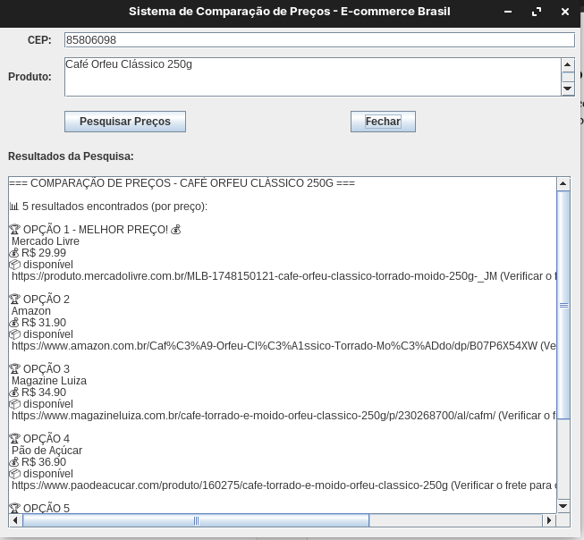

# 🛒 Sistema de Comparação de Preços - E-commerce Brasil

Um sistema inteligente para comparar preços de produtos em múltiplos e-commerces brasileiros, utilizando **Google Gemini AI** para busca automatizada e análise de preços.


## 📋 Índice

- [Sobre o Projeto](#-sobre-o-projeto)
- [Funcionalidades](#-funcionalidades)
- [Tecnologias Utilizadas](#-tecnologias-utilizadas)
- [Pré-requisitos](#-pré-requisitos)
- [Instalação](#-instalação)
- [Como Usar](#-como-usar)
- [Configuração da API](#-configuração-da-api)
- [Screenshots](#-screenshots)
- [Contribuição](#-contribuição)
- [Licença](#-licença)

## 🎯 Sobre o Projeto

O **Sistema de Comparação de Preços** é uma aplicação desktop Java que utiliza inteligência artificial para pesquisar automaticamente preços de produtos nos principais e-commerces brasileiros, incluindo:

- 🟡 **Mercado Livre**
- 🟠 **Amazon Brasil**
- 🔵 **Magazine Luiza**
- 🟤 **Casas Bahia**
- 🟣 **Submarino**
- 🔴 **Americanas**
- E outros marketplaces nacionais

### 🚀 Diferenciais

- ✅ **Busca Inteligente com IA** - Utiliza Google Gemini para análise contextual
- ✅ **Interface Gráfica Moderna** - Swing com UX otimizada
- ✅ **Ordenação Automática** - Resultados organizados por melhor preço
- ✅ **Consideração de Frete** - Cálculo baseado no CEP informado
- ✅ **Pesquisa Assíncrona** - Interface não trava durante a busca
- ✅ **Múltiplos Formatos** - Aceita nome do produto ou código de barras

## ⭐ Funcionalidades

### 🔍 Pesquisa Avançada
- Busca por **nome do produto** ou **código de barras**
- Análise de **disponibilidade** em tempo real
- Cálculo de **frete por CEP**
- Comparação entre **múltiplas lojas**

### 📊 Análise de Resultados
- **Top 5 melhores ofertas** ordenadas por preço
- **Indicação do melhor negócio** com destaque visual
- **Economia potencial** entre maior e menor preço
- **Links diretos** para as lojas

### 🎨 Interface Intuitiva
- **Campos inteligentes** com placeholders dinâmicos
- **Barra de progresso** durante a pesquisa
- **Área de resultados** com scroll automático
- **Validação de entrada** em tempo real

## 🛠 Tecnologias Utilizadas

- **Java 11+** - Linguagem principal
- **Swing** - Interface gráfica nativa
- **Google Gemini 2.0 Flash** - Inteligência artificial
- **HTTP Client** - Comunicação com APIs
- **JSON** - Formato de dados
- **Regex** - Processamento de texto
- **SwingWorker** - Threading para UI responsiva

## 📋 Pré-requisitos

Antes de executar o projeto, certifique-se de ter:

- ☕ **Java Development Kit (JDK) 11** ou superior
- 🔑 **Google Gemini API Key** (gratuita)
- 🌐 **Conexão com internet** ativa
- 💻 **Sistema operacional**: Windows, macOS ou Linux

### 🔑 Obtendo a API Key do Google Gemini

1. Acesse [Google AI Studio](https://makersuite.google.com/app/apikey)
2. Faça login com sua conta Google
3. Clique em **"Create API Key"**
4. Copie a chave gerada
5. **Importante**: Mantenha sua API key segura e privada

## 🚀 Instalação

### Clone o repositório
```bash
git clone https://github.com/seu-usuario/market-search.git
cd market-search
```

### Compile o projeto
```bash
# Navegue até o diretório src
cd src

# Compile as classes Java
javac -d ../bin marketsearch/*.java

# Execute o programa
cd ../bin
java marketsearch.MainScreen
```

### Ou usando IDE
1. Abra o projeto em sua IDE favorita (IntelliJ IDEA, Eclipse, NetBeans)
2. Configure o JDK 11+ no projeto
3. Execute a classe `MainScreen.java`

## 📖 Como Usar

### 1️⃣ Iniciando a Aplicação
Execute o programa e a interface será exibida:



### 2️⃣ Preenchendo os Dados
- **CEP**: Digite seu CEP para cálculo preciso do frete
- **Produto**: Insira o nome do produto ou código de barras

### 3️⃣ Configurando a API (Primeira Execução)
- Na primeira pesquisa, será solicitada sua **Google Gemini API Key**
- Cole a chave obtida no Google AI Studio
- A configuração é salva para próximas execuções

### 4️⃣ Realizando a Pesquisa
- Clique em **"Pesquisar Preços"**
- Aguarde a barra de progresso (pode levar 10-30 segundos)
- Os resultados aparecerão automaticamente na área inferior

### 5️⃣ Analisando os Resultados
- **Opção 1** sempre será o **melhor preço** 💰
- Cada resultado mostra: loja, preço, disponibilidade e link
- Um resumo final indica a **economia potencial**

## 🔧 Configuração da API

### Limites da API Gratuita
- **1.500 requisições por dia**
- **15 requisições por minuto**
- **1 milhão de tokens por minuto**

### Configurações Avançadas
Para personalizar a configuração da API, edite o arquivo `MarketSearch.java`:

```java
// URL personalizada (opcional)
private static final String GEMINI_API_URL = "sua-url-personalizada";

// Parâmetros do modelo
"generationConfig": {
    "temperature": 0.7,        // Criatividade (0.0-1.0)
    "maxOutputTokens": 2000    // Limite de resposta
}
```

## 💡 Exemplos de Uso

### Exemplo 1: Smartphone
```
CEP: 01310-100
Produto: iPhone 15 128GB
```
**Resultado**: 5 lojas comparadas, economia de até R$ 350,00

### Exemplo 2: Eletrodoméstico
```
CEP: 20040-020
Produto: Geladeira Brastemp 375L
```
**Resultado**: Melhor preço encontrado com 23% de desconto

### Exemplo 3: Código de Barras
```
CEP: 30112-000
Produto: 7891000100103
```
**Resultado**: Produto identificado automaticamente pela IA

## 🤝 Contribuição

Contribuições são muito bem-vindas! Para contribuir:

1. **Fork** o projeto
2. **Crie** uma branch para sua feature (`git checkout -b feature/NovaFuncionalidade`)
3. **Commit** suas mudanças (`git commit -m 'Adiciona nova funcionalidade'`)
4. **Push** para a branch (`git push origin feature/NovaFuncionalidade`)
5. **Abra** um Pull Request

### 🐛 Reportando Bugs

Para reportar bugs, abra uma [Issue](https://github.com/seu-usuario/market-search/issues) com:
- **Descrição detalhada** do problema
- **Passos para reproduzir**
- **Logs de erro** (se houver)
- **Screenshots** (se aplicável)

### 💡 Sugestões de Melhorias

- [ ] Salvamento de pesquisas favoritas
- [ ] Exportação de resultados para Excel/PDF
- [ ] Histórico de pesquisas
- [ ] Notificações de mudança de preço
- [ ] Integração com mais marketplaces
- [ ] Modo escuro da interface

## 📄 Licença

Este projeto está sob a licença **MIT**. Veja o arquivo [LICENSE](LICENSE) para mais detalhes.

```
MIT License

Copyright (c) 2024 Market Search

Permission is hereby granted, free of charge, to any person obtaining a copy
of this software and associated documentation files (the "Software"), to deal
in the Software without restriction, including without limitation the rights
to use, copy, modify, merge, publish, distribute, sublicense, and/or sell
copies of the Software, and to permit persons to whom the Software is
furnished to do so, subject to the following conditions:

The above copyright notice and this permission notice shall be included in all
copies or substantial portions of the Software.
```


---

### 🌟 Se este projeto te ajudou, considere dar uma ⭐!

**Desenvolvido com ❤️ para a comunidade brasileira de e-commerce**
